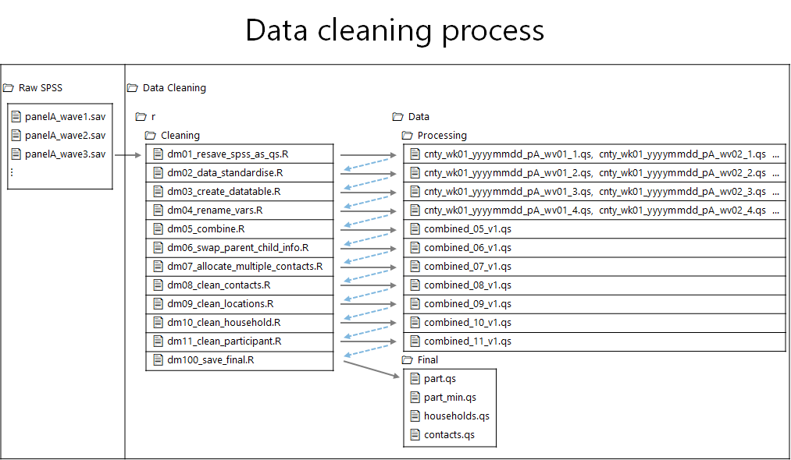

# CoMix data cleaning

Code for cleaning the data recieved for the CoMix contact survey.

# Folder structure

* `r` - for R scripts
* `r/functions` - store user written functions for the cleaning
* `r/version_N` - code for running version N of the data cleaning
* `r/validation` - code for running validation updates on the data
* `data` - for the datasets
* `data/processing` - for interim cleaning datasets
* `data/clean` - for cleaned datasets
* `codebooks` - Codebooks used for data cleaning
* `admin` - For information about the cleaning

# Code versions

The survey has changed since it started in the UK on the 23rd of March and there have been slight differences in the questions that have been asked and the structure of the data. This has led to code being duplicated in the `r` folder. Each version has a seperate folder titled version_N and will work for the following data.

* version_1 = Panel A for Norway, Belgium, Netherlands, and the UK. Panel B for the UK
* version_2 = Panel C and D (Parents panels) for the UK
* version_3 = Panels E and F for the UK
* version_4 = Group 1, 2, and 3 EU countries
* version_5 = Panel B for Belgium survey (includes parents)
* version_6 = Panel B for Netherlands (includes parents)

# Running the data cleaning

In the main folder `comix_data_clean` there are shell scripts which can be run from the terminal within RStudio. These script run the analysis for a specific version from begining to end. 

## For Mac
1. Open Rstudio
2. Go to the terminal in Rstudio
3. Type `sh run_version_1.sh`

Change version_1 to be the relevant version for you.

## For Windows

0. [Add R to your path variable (see below)](#Add-R-to-your-path-variable)
1. Open Rstudio
2. Go to the terminal in R studio
3. Type `sh run_version_1.sh`

Change version_1 to be the relevant version for you.

For example to run version 1 you type `sh run_version_1.sh` into the **terminal** (not the R console) and it will run each R script in sequence.

**Note:** Using shell scripts like this mean that each R script must be self contained and be able to run from start to finish in a fresh session. Therefore, loading packages, call to other scripts and loading and saving data must all happen within that single script. 

**Options:** For some of the shell scripts we add options such as download the data or just run on the data already present. The shell scripts can be updated so that you're not running everything from scratch from the very beggining. 

# Cleaning process

There are 11 steps of cleaning in each version followed by two steps of saving the data (locally and potentially remotely)

Each step loads and saves a new dataset (qs file). Steps 1-4 are run on the weekly data seperately. Step 5 combines all data within a version, then 6-11 are run on all of the data.

1. dm01_resave_spss_as_qs: This script will read in the raw spss file and rename it according to the filenaming convention and save the file locally
2. dm02_data_standardise: Ensures that country, panel, wave, and survey round are found in the data. It also renames looop and scale variables
3. dm03_create_datatable: The data we recieve is wide with one column per contact, we reshape this so that the each row is either a participant, household member, or contact.
4. dm04_rename_vars: Based on a spreadsheet the variables are renamed to more human readble names
5. dm05_combine_data: Combine all the data within a version into a single dataset.
6. dm06_swap_parent_child_info: We swap parent and child information so that the child information is in the same place as an adult participant.
7. dm07_allocate_multiple_contacts: Participants can report mass contacts, we allocate them to one contact per row.
8. dm08_clean_contacts: Code relating to cleaning contacts should go here, and this saves a version of the contact dataset.
9. dm09_clean_locations: This uses a spreadsheet to clean misspelling of location names
10. dm10_clean_household: Code relating to households goes here, and it save a household dataset
11. dm11_clean_participant: Code relating to cleaning the participant data goes here and it save the participant dataset.

**Saving data**

100. dm100_save_locally: This will take the participant, contact, and household data and save a version locally as well as an archive of the version (per day)
101. dm101_save_remote: This will save the data to a remote file location. If everything if being run locally this script could be ignored. 

# Validation process

Once all of the cleaning scripts have been run, then we go to the validation folder.

The scripts are 

1. dm00_combine: Combine all the cleaned data.
2. dm01_update_values: This will update values in the data based on a spreadsheet 
3. dm02_identify_change: This script is used to find issues with the data to be updated via the spreadsheet validation_list
4. dm100_save_locally: Save validated data and save locally
5. dm101_save_remote: Save validated data remotely

The process is to run dm00 to combine the files and then loop between dm01 and dm02 to validate the data. The spreadsheet validation_list is not kept on github as this contains identifiable information.

# Getting a final dataset

Once validation is complete or a best dataset is required, run dm100 and then dm101 if a local and remote dataset is required.

# Setting up a new user or machine

## Add R to your path variable

This only needs to be done once. Note for step 8 you need to put the path to your R\bin file. 

1. Select Start => Control Panel
2. Enter ‘environment’ in the search box and press RETURN
3. Click Edit the system environment variables
4. Click Advanced tab
5. Click Environment Variables…
6. Under User variables select PATH
7. Click Edit…
8. Add C:\Program Files\R\R-V.v.0\bin to end of Variable value, taking care to remove trailing spaces
9. Click OK
10. Click OK
11. Click OK

Check this has worked by going to powershell and typing `R.exe` a session of R should start. 

## Add filepaths for new user to 

`./r/00_setup_filepaths.r`

# Actions

The actions that you may need for cleaning the data fall into the following. 

**[1. Add a new dataset/ replace an old dataset with a new version](#add-new-or-replace-old-data) **
&nbsp;[a. Update a single country with the latest data](#single-country) 
&nbsp;[b. Update multiple countries with the latest data](#multiple-countries) 
**[2. Reclean old data](#reclean-old-data) **
&nbsp;[a. Reclean a single dataset](#single-dataset) 
&nbsp;[b. Reclean all datasets for a single country](#all-datasets-single-country) 
&nbsp;[c. Reclean all datsets for all countries](#all-datasets-all-countries) 
**[3. Combining data](#combine-data) **
&nbsp;[a. Combining all data for a single country](#combine-single-country) 
&nbsp;[b. Combining all data for all countries](#combine-all-countries) 
**[4. Add new variables](#add-new-variables) **
&nbsp;[a. New variables created in the raw data](#new-survey-variable) 
&nbsp;[b. New user defined variable](#new-analysis-variable) 
**[5. Add checks](#add-checks) **
**[6. Sharing data](#share-data) **
&nbsp;[a. Create summary datsets for sharing](#summary-data) 
&nbsp;[b. Sharing individual level data](#individual-level-data) 

# Add new or replace old data
## Single country

### 1. SPSS file

The SPSS data should be stored on the LSHTM shared drive.

SPSS files are recieved via email as zipped files. Save the files on the LSHTM shared drive folder at X.
Extract the file, this will require a password. Check with Chris, Amy, or Kerry for file passwords
Then save the extracted spss file in data/spss/country_code. The country_codes are

Country | Country_code | 
--- | --- | 
United Kingdom | UK | 
Norway | NO | 
Netherlands | NL |
Belgium | BE |
Add country | Add country_code|

### 2. Update spreadsheet

1. Open the spreadsheet in data/spss_files.xlsx
2. Go to the relevant country tab 
3. Add the information for SPSS file to the bottom of the sheet
4. Fill in the Panel, Wave, date recieved, week, spss filename, and drag down the formula for the R file_name. 

### 3. Save SPSS as RDS

**We could have separate scripts that run for just one file or one timepoint at a time**

1. Open `dm01_resave_spss_as_manual.rds` 
2. Update the country code and then run the first section of the code to save the RDS file.

For multiple countries there is further code which can loop through the different parts. 

The SPSS files are loaded and then turned into RDS files. 

The file naming convention for the RDS files. 

cnty_wkN_yyyymmdd_pN_wvN_extranotes.RDS

* Cnty = country code uk, nl, be
* wk = survey week
* yyyymmdd = date that file was sent
* pN =  panel
* wv = wave number
* extranotes = it could be interim data, or for updates of the data.

## Multiple countries

# Reclean old data

## Single dataset

## All datasets single country

## All datasets all countries

# Combine data

## Combine single country
# Combine all countries

# Add new variables

## New survey variable

## New analysis variable

*

# Add checks

# Share data

## Individual level data

